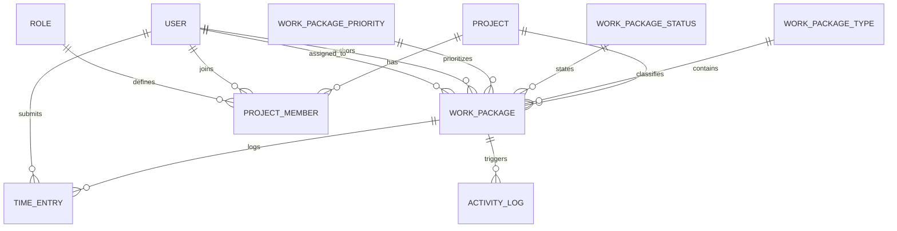

# Architecture & System Design

This document details the system design, domain entities, database relationships, and design patterns utilized in **OpenProject Laravel**.

---

## 1. Domain Entities & Database Model

---

## 2. Core Tables & Schemas

### `projects`
- `id` (bigint, PK)
- `name` (string)
- `identifier` (string, unique slug)
- `description` (text, nullable)
- `parent_id` (bigint, nullable, self-referencing FK)
- `status` (enum: `active`, `archived`)
- `is_public` (boolean, default: true)
- `timestamps`

### `work_packages`
- `id` (bigint, PK)
- `project_id` (bigint, FK)
- `parent_id` (bigint, nullable, self-referencing FK for subtasks)
- `type_id` (bigint, FK -> `work_package_types`)
- `status_id` (bigint, FK -> `work_package_statuses`)
- `priority_id` (bigint, FK -> `work_package_priorities`)
- `author_id` (bigint, FK -> `users`)
- `assignee_id` (bigint, nullable, FK -> `users`)
- `subject` (string)
- `description` (longText, nullable)
- `start_date` (date, nullable)
- `due_date` (date, nullable)
- `estimated_hours` (decimal 8,2, nullable)
- `done_ratio` (unsigned tinyint, 0-100)
- `position` (integer, default: 0)
- `timestamps`

### `work_package_types`
- `id` (bigint, PK)
- `name` (e.g. Task, Bug, Feature, Milestone)
- `color` (hex color string)
- `icon` (icon identifier)
- `is_milestone` (boolean)
- `position` (integer)

### `work_package_statuses`
- `id` (bigint, PK)
- `name` (e.g. Open, In Progress, In Review, Resolved, Closed, Rejected)
- `color` (hex color string)
- `is_closed` (boolean)
- `position` (integer)

### `work_package_priorities`
- `id` (bigint, PK)
- `name` (e.g. Low, Normal, High, Urgent, Immediate)
- `color` (hex color string)
- `position` (integer)

### `time_entries`
- `id` (bigint, PK)
- `project_id` (bigint, FK)
- `work_package_id` (bigint, FK)
- `user_id` (bigint, FK)
- `hours` (decimal 8,2)
- `spent_on` (date)
- `comments` (string, nullable)
- `timestamps`

---

## 3. Request Flow & Blade Architecture

1. **Routing (`routes/web.php`)**: Standard resource routes and nested project routes.
2. **Controllers (`app/Http/Controllers`)**: Clean controllers utilizing Form Requests for validation.
3. **Blade Components (`resources/views/components`)**:
   - `x-layout.app`: Main responsive dashboard shell with sidebar, user menu, search, breadcrumbs.
   - `x-badge`: Status, priority, and type badges with corresponding brand colors.
   - `x-modal`: Lightweight Alpine.js modal wrapper.
   - `x-dropdown`: Accessible Alpine.js menu wrapper.
4. **Kanban Reactive Engine (`resources/views/projects/kanban.blade.php`)**:
   - Alpine.js component wrapping `SortableJS`.
   - Asynchronous `fetch()` calls to update task statuses and positions instantly on drag & drop.
