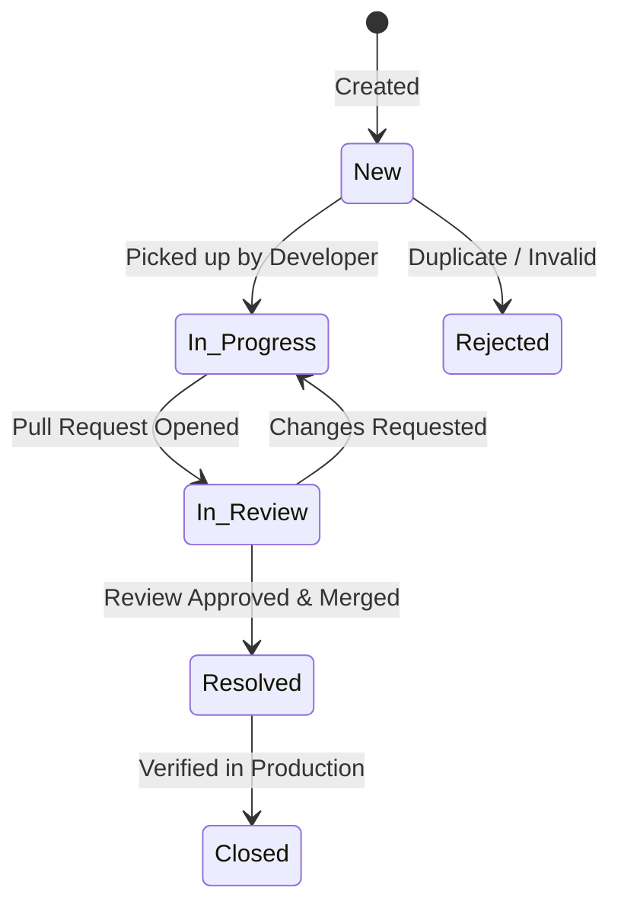

# Work Packages & Workflows

A **Work Package** is the atomic unit of work in OpenProject Laravel. Work packages generalize tasks, user stories, software bugs, features, and milestones into a flexible, stateful workflow system.

---

## 1. Work Package Types

| Type | Purpose | Behavior |
| :--- | :--- | :--- |
| **Task** | Standard operational work, development tasks, technical chores | Has start date, due date, estimation, and spent time. |
| **Bug** | Defect reports, security fixes, regression issues | Prioritized by severity, lifecycle tracked until resolved. |
| **Feature** | High-level user story or capability | Aggregates subtasks and deliverables. |
| **Milestone** | Key schedule deliverable or sprint freeze | Represents a point in time (`start_date == due_date`). |

---

## 2. Work Package Status Lifecycles

### Status Meanings
1. **New**: Task has been created and placed in the project backlog.
2. **In Progress**: An assignee is actively working or coding.
3. **In Review**: Ready for code review, QA testing, or design validation.
4. **Resolved**: Successfully tested and merged.
5. **Closed**: Concluded and locked. Automatically sets progress (`done_ratio`) to 100%.

---

## 3. Prioritization Matrix

- **Low**: Non-blocking improvements or aesthetic enhancements.
- **Normal**: Standard sprint commitments.
- **High**: Urgent customer deliverables or sprint-blockers.
- **Urgent**: Critical bugs impacting current releases.
- **Immediate**: Production outage or zero-day security vulnerabilities.

---

## 4. Time Tracking & Estimates

Every work package tracks:
- **Estimated Hours**: Target budgeted time for the task.
- **Spent Time**: Sum of logged hours contributed by team members.
- **Progress (`done_ratio`)**: Value from 0% to 100% reflecting actual completion.
